# Clov DB — 최종 ERD & DDL (MySQL 8)

> [../../docs-archive/Clov_DB_설계.md](../../docs-archive/Clov_DB_설계.md)(archive 원본) + [03-db-extensions.md](03-db-extensions.md)(확정 델타)를 **통합한 최종 스키마**. 이 문서가 구현 기준이다.
> 대상: MySQL 8 · InnoDB · `utf8mb4`. 컨벤션: `snake_case`, `BIGINT PK AUTO_INCREMENT`, 상태값은 `VARCHAR` + 컬럼 코멘트(archive 관례).
> ✨ = archive에 없던 신규(테이블/컬럼).

---

## 1. ERD

```mermaid
erDiagram
    USERS ||--o{ ROOM_MEMBERS : joins
    FRIENDSHIP_ROOMS ||--o{ ROOM_MEMBERS : has
    FRIENDSHIP_ROOMS ||--o{ ROOM_INVITES : has
    USERS ||--o{ ROOM_INVITES : creates

    FRIENDSHIP_ROOMS ||--o{ JOIN_REQUESTS : receives
    USERS ||--o{ JOIN_REQUESTS : applies

    FRIENDSHIP_ROOMS ||--o{ PLANS : has
    USERS ||--o{ PLANS : writes
    PLANS ||--o{ PLAN_CHECKLISTS : has
    PLANS ||--o{ PLAN_STAGE_PHOTOS : has

    FRIENDSHIP_ROOMS ||--o{ MEMORIES : has
    PLANS ||--o{ MEMORIES : converts_to
    USERS ||--o{ MEMORIES : writes
    MEMORIES ||--o{ MEMORY_IMAGES : has
    MEMORIES ||--o{ MEMORY_MESSAGES : has
    MEMORIES ||--o{ MEMORY_PARTICIPANTS : tags
    USERS ||--o{ MEMORY_MESSAGES : leaves
    USERS ||--o{ MEMORY_PARTICIPANTS : joins

    FRIENDSHIP_ROOMS ||--o{ LUCKY_LETTERS : has
    USERS ||--o{ LUCKY_LETTERS : sends
    USERS ||--o{ LUCKY_LETTERS : receives

    FRIENDSHIP_ROOMS ||--o{ NOTIFICATIONS : has
    USERS ||--o{ NOTIFICATIONS : receives

    FRIENDSHIP_ROOMS ||--o{ FRIENDSHIP_EXP_LOGS : earns
    USERS ||--o{ FRIENDSHIP_EXP_LOGS : triggers

    USERS {
        BIGINT id PK
        VARCHAR email UK
        VARCHAR password "nullable(소셜 전용)"
        VARCHAR oauth_provider "nullable ✨"
        VARCHAR oauth_subject "nullable ✨"
        VARCHAR nickname
        VARCHAR personal_invite_code UK
        VARCHAR avatar_url "✨"
        DATE birth_date "✨ nullable"
        VARCHAR status_message "✨ nullable"
        DATETIME withdrawn_at "✨ 익명화 nullable"
        DATETIME created_at
        DATETIME updated_at
    }
    FRIENDSHIP_ROOMS {
        BIGINT id PK
        VARCHAR name
        INT friendship_level
        INT exp_point
        VARCHAR status "ACTIVE/INACTIVE/ARCHIVED"
        VARCHAR cover_image_url "✨ nullable"
        VARCHAR cover_title "✨ nullable"
        VARCHAR theme_color "✨ nullable"
        DATETIME created_at
        DATETIME updated_at
    }
    ROOM_MEMBERS {
        BIGINT id PK
        BIGINT room_id FK
        BIGINT user_id FK
        VARCHAR status "ACTIVE/LEFT"
        DATETIME joined_at
        DATETIME left_at
        DATETIME created_at
        DATETIME updated_at
    }
    ROOM_INVITES {
        BIGINT id PK
        BIGINT room_id FK
        BIGINT created_by FK
        VARCHAR invite_code UK
        VARCHAR status "ACTIVE/USED/EXPIRED/CANCELED"
        DATETIME expires_at
        DATETIME created_at
        DATETIME used_at
    }
    JOIN_REQUESTS {
        BIGINT id PK
        BIGINT room_id FK
        BIGINT applicant_id FK
        VARCHAR invite_code
        VARCHAR invite_path "INVITED/DIRECT"
        VARCHAR status "PENDING/ACCEPTED/REJECTED"
        BIGINT accepted_by FK "nullable"
        DATETIME accepted_at "nullable"
        DATETIME canceled_at "nullable"
        DATETIME created_at
    }
    PLANS {
        BIGINT id PK
        BIGINT room_id FK
        BIGINT writer_id FK
        VARCHAR title
        DATE plan_date
        TIME plan_time
        VARCHAR place_name
        VARCHAR address
        TEXT description
        VARCHAR status "SCHEDULED/COMPLETED/CANCELED"
        VARCHAR memory_status "NONE/CANDIDATE/WRITTEN/SKIPPED"
        DATETIME completed_at
        DATETIME memory_candidate_created_at
        DATETIME created_at
        DATETIME updated_at
    }
    PLAN_CHECKLISTS {
        BIGINT id PK
        BIGINT plan_id FK
        VARCHAR content
        BOOLEAN checked
        DATETIME created_at
        DATETIME updated_at
    }
    PLAN_STAGE_PHOTOS {
        BIGINT id PK
        BIGINT plan_id FK
        VARCHAR stage "PROPOSAL/SCHEDULING/CONFIRMED/MEETING ✨"
        VARCHAR image_url
        BIGINT uploaded_by FK
        DATETIME uploaded_at
    }
    MEMORIES {
        BIGINT id PK
        BIGINT room_id FK
        BIGINT plan_id FK "✨ nullable = FREE MEMORY"
        BIGINT writer_id FK
        VARCHAR title
        TEXT content
        VARCHAR mood_tag
        DATE memory_date
        DATETIME deleted_at "✨ soft delete nullable"
        DATETIME created_at
        DATETIME updated_at
    }
    MEMORY_IMAGES {
        BIGINT id PK
        BIGINT memory_id FK
        VARCHAR image_url
        INT sort_order
        DATETIME created_at
    }
    MEMORY_MESSAGES {
        BIGINT id PK
        BIGINT memory_id FK
        BIGINT writer_id FK
        VARCHAR content
        DATETIME created_at
    }
    MEMORY_PARTICIPANTS {
        BIGINT id PK
        BIGINT memory_id FK
        BIGINT user_id FK
    }
    LUCKY_LETTERS {
        BIGINT id PK
        BIGINT room_id FK
        BIGINT sender_id FK
        BIGINT receiver_id FK "✨ nullable = 전체발송"
        TEXT content
        VARCHAR emoji "✨ nullable"
        BOOLEAN is_favorite
        DATETIME read_at
        DATETIME sent_at
    }
    NOTIFICATIONS {
        BIGINT id PK
        BIGINT room_id FK
        BIGINT user_id FK
        VARCHAR type "NOTICE/FRIEND/JOIN ✨"
        JSON payload
        DATETIME read_at
        DATETIME created_at
    }
    FRIENDSHIP_EXP_LOGS {
        BIGINT id PK
        BIGINT room_id FK
        BIGINT triggered_by FK
        VARCHAR action_type "PLAN_CREATE/PLAN_COMPLETE/MEMORY_WRITE/LETTER_SEND/MASCOT_INTERACT"
        INT exp_delta
        BIGINT reference_id
        DATETIME created_at
    }
```



---

## 2. DDL (MySQL 8)

```sql
SET NAMES utf8mb4;

-- 1. USERS
CREATE TABLE users (
  id                    BIGINT       NOT NULL AUTO_INCREMENT,
  email                 VARCHAR(255) NOT NULL,
  password              VARCHAR(255) NULL COMMENT '소셜 전용 계정은 NULL',
  oauth_provider        VARCHAR(20)  NULL COMMENT 'kakao/naver/google',
  oauth_subject         VARCHAR(255) NULL COMMENT '소셜 고유 식별자',
  nickname              VARCHAR(50)  NOT NULL,
  personal_invite_code  VARCHAR(20)  NOT NULL,
  avatar_url            VARCHAR(512) NULL,
  birth_date            DATE         NULL,
  status_message        VARCHAR(100) NULL,
  withdrawn_at          DATETIME     NULL COMMENT '탈퇴=익명화(soft), 기록 보존',
  created_at            DATETIME     NOT NULL DEFAULT CURRENT_TIMESTAMP,
  updated_at            DATETIME     NOT NULL DEFAULT CURRENT_TIMESTAMP ON UPDATE CURRENT_TIMESTAMP,
  PRIMARY KEY (id),
  UNIQUE KEY uk_users_email (email),
  UNIQUE KEY uk_users_invite_code (personal_invite_code),
  UNIQUE KEY uk_users_oauth (oauth_provider, oauth_subject)
) ENGINE=InnoDB DEFAULT CHARSET=utf8mb4;

-- 2. FRIENDSHIP_ROOMS
CREATE TABLE friendship_rooms (
  id                BIGINT       NOT NULL AUTO_INCREMENT,
  name              VARCHAR(100) NOT NULL,
  friendship_level  INT          NOT NULL DEFAULT 1,
  exp_point         INT          NOT NULL DEFAULT 0,
  status            VARCHAR(20)  NOT NULL DEFAULT 'ACTIVE' COMMENT 'ACTIVE/INACTIVE/ARCHIVED',
  cover_image_url   VARCHAR(512) NULL,
  cover_title       VARCHAR(100) NULL,
  theme_color       VARCHAR(20)  NULL,
  created_at        DATETIME     NOT NULL DEFAULT CURRENT_TIMESTAMP,
  updated_at        DATETIME     NOT NULL DEFAULT CURRENT_TIMESTAMP ON UPDATE CURRENT_TIMESTAMP,
  PRIMARY KEY (id)
) ENGINE=InnoDB DEFAULT CHARSET=utf8mb4;

-- 3. ROOM_MEMBERS
CREATE TABLE room_members (
  id          BIGINT      NOT NULL AUTO_INCREMENT,
  room_id     BIGINT      NOT NULL,
  user_id     BIGINT      NOT NULL,
  status      VARCHAR(20) NOT NULL DEFAULT 'ACTIVE' COMMENT 'ACTIVE/LEFT',
  joined_at   DATETIME    NOT NULL DEFAULT CURRENT_TIMESTAMP,
  left_at     DATETIME    NULL,
  created_at  DATETIME    NOT NULL DEFAULT CURRENT_TIMESTAMP,
  updated_at  DATETIME    NOT NULL DEFAULT CURRENT_TIMESTAMP ON UPDATE CURRENT_TIMESTAMP,
  PRIMARY KEY (id),
  UNIQUE KEY uk_room_members (room_id, user_id),
  KEY idx_room_members_user (user_id),
  CONSTRAINT fk_room_members_room FOREIGN KEY (room_id) REFERENCES friendship_rooms(id),
  CONSTRAINT fk_room_members_user FOREIGN KEY (user_id) REFERENCES users(id)
) ENGINE=InnoDB DEFAULT CHARSET=utf8mb4;

-- 4. ROOM_INVITES
CREATE TABLE room_invites (
  id           BIGINT      NOT NULL AUTO_INCREMENT,
  room_id      BIGINT      NOT NULL,
  created_by   BIGINT      NOT NULL COMMENT '이력용, 권한 아님',
  invite_code  VARCHAR(20) NOT NULL,
  status       VARCHAR(20) NOT NULL DEFAULT 'ACTIVE' COMMENT 'ACTIVE/USED/EXPIRED/CANCELED',
  expires_at   DATETIME    NULL,
  created_at   DATETIME    NOT NULL DEFAULT CURRENT_TIMESTAMP,
  used_at      DATETIME    NULL,
  PRIMARY KEY (id),
  UNIQUE KEY uk_room_invites_code (invite_code),
  KEY idx_room_invites_room (room_id),
  CONSTRAINT fk_room_invites_room FOREIGN KEY (room_id) REFERENCES friendship_rooms(id),
  CONSTRAINT fk_room_invites_creator FOREIGN KEY (created_by) REFERENCES users(id)
) ENGINE=InnoDB DEFAULT CHARSET=utf8mb4;

-- 5. JOIN_REQUESTS ✨ (가입 신청·승인 — D1)
CREATE TABLE join_requests (
  id           BIGINT      NOT NULL AUTO_INCREMENT,
  room_id      BIGINT      NOT NULL,
  applicant_id BIGINT      NOT NULL,
  invite_code  VARCHAR(20) NULL,
  invite_path  VARCHAR(20) NOT NULL DEFAULT 'DIRECT' COMMENT 'INVITED/DIRECT',
  status       VARCHAR(20) NOT NULL DEFAULT 'PENDING' COMMENT 'PENDING/ACCEPTED/REJECTED',
  accepted_by  BIGINT      NULL,
  accepted_at  DATETIME    NULL COMMENT '되돌리기 5분 기준',
  canceled_at  DATETIME    NULL,
  created_at   DATETIME    NOT NULL DEFAULT CURRENT_TIMESTAMP,
  PRIMARY KEY (id),
  KEY idx_join_requests_room_status (room_id, status),
  KEY idx_join_requests_applicant (applicant_id),
  CONSTRAINT fk_join_requests_room FOREIGN KEY (room_id) REFERENCES friendship_rooms(id),
  CONSTRAINT fk_join_requests_applicant FOREIGN KEY (applicant_id) REFERENCES users(id),
  CONSTRAINT fk_join_requests_acceptor FOREIGN KEY (accepted_by) REFERENCES users(id)
) ENGINE=InnoDB DEFAULT CHARSET=utf8mb4;
-- 중복 PENDING 신청 방지는 앱 트랜잭션(수락 시 낙관적 락)으로 보강. 동시 수락 경합 → 409.

-- 6. PLANS
CREATE TABLE plans (
  id                           BIGINT       NOT NULL AUTO_INCREMENT,
  room_id                      BIGINT       NOT NULL,
  writer_id                    BIGINT       NOT NULL,
  title                        VARCHAR(100) NOT NULL,
  plan_date                    DATE         NULL,
  plan_time                    TIME         NULL,
  place_name                   VARCHAR(100) NULL,
  address                      VARCHAR(255) NULL,
  description                  TEXT         NULL,
  status                       VARCHAR(20)  NOT NULL DEFAULT 'SCHEDULED' COMMENT 'SCHEDULED/COMPLETED/CANCELED',
  memory_status                VARCHAR(20)  NOT NULL DEFAULT 'NONE' COMMENT 'NONE/CANDIDATE/WRITTEN/SKIPPED',
  completed_at                 DATETIME     NULL,
  memory_candidate_created_at  DATETIME     NULL,
  created_at                   DATETIME     NOT NULL DEFAULT CURRENT_TIMESTAMP,
  updated_at                   DATETIME     NOT NULL DEFAULT CURRENT_TIMESTAMP ON UPDATE CURRENT_TIMESTAMP,
  PRIMARY KEY (id),
  KEY idx_plans_room_date (room_id, plan_date),
  CONSTRAINT fk_plans_room FOREIGN KEY (room_id) REFERENCES friendship_rooms(id),
  CONSTRAINT fk_plans_writer FOREIGN KEY (writer_id) REFERENCES users(id)
) ENGINE=InnoDB DEFAULT CHARSET=utf8mb4;

-- 7. PLAN_CHECKLISTS
CREATE TABLE plan_checklists (
  id          BIGINT       NOT NULL AUTO_INCREMENT,
  plan_id     BIGINT       NOT NULL,
  content     VARCHAR(255) NOT NULL,
  checked     BOOLEAN      NOT NULL DEFAULT FALSE,
  created_at  DATETIME     NOT NULL DEFAULT CURRENT_TIMESTAMP,
  updated_at  DATETIME     NOT NULL DEFAULT CURRENT_TIMESTAMP ON UPDATE CURRENT_TIMESTAMP,
  PRIMARY KEY (id),
  KEY idx_plan_checklists_plan (plan_id),
  CONSTRAINT fk_plan_checklists_plan FOREIGN KEY (plan_id) REFERENCES plans(id)
) ENGINE=InnoDB DEFAULT CHARSET=utf8mb4;

-- 8. PLAN_STAGE_PHOTOS ✨ (인생4컷 인증사진)
CREATE TABLE plan_stage_photos (
  id           BIGINT       NOT NULL AUTO_INCREMENT,
  plan_id      BIGINT       NOT NULL,
  stage        VARCHAR(20)  NOT NULL COMMENT 'PROPOSAL/SCHEDULING/CONFIRMED/MEETING',
  image_url    VARCHAR(512) NOT NULL,
  uploaded_by  BIGINT       NOT NULL,
  uploaded_at  DATETIME     NOT NULL DEFAULT CURRENT_TIMESTAMP,
  PRIMARY KEY (id),
  UNIQUE KEY uk_plan_stage (plan_id, stage) COMMENT '단계당 1장, 업로드 후 잠금',
  CONSTRAINT fk_plan_stage_plan FOREIGN KEY (plan_id) REFERENCES plans(id),
  CONSTRAINT fk_plan_stage_uploader FOREIGN KEY (uploaded_by) REFERENCES users(id)
) ENGINE=InnoDB DEFAULT CHARSET=utf8mb4;

-- 9. MEMORIES
CREATE TABLE memories (
  id           BIGINT       NOT NULL AUTO_INCREMENT,
  room_id      BIGINT       NOT NULL,
  plan_id      BIGINT       NULL COMMENT 'NULL=FREE MEMORY(D3)',
  writer_id    BIGINT       NOT NULL,
  title        VARCHAR(100) NOT NULL,
  content      TEXT         NULL,
  mood_tag     VARCHAR(50)  NULL,
  memory_date  DATE         NULL,
  deleted_at   DATETIME     NULL COMMENT 'soft delete',
  created_at   DATETIME     NOT NULL DEFAULT CURRENT_TIMESTAMP,
  updated_at   DATETIME     NOT NULL DEFAULT CURRENT_TIMESTAMP ON UPDATE CURRENT_TIMESTAMP,
  PRIMARY KEY (id),
  KEY idx_memories_room_date (room_id, memory_date),
  KEY idx_memories_plan (plan_id),
  KEY idx_memories_writer (writer_id),
  CONSTRAINT fk_memories_room FOREIGN KEY (room_id) REFERENCES friendship_rooms(id),
  CONSTRAINT fk_memories_plan FOREIGN KEY (plan_id) REFERENCES plans(id),
  CONSTRAINT fk_memories_writer FOREIGN KEY (writer_id) REFERENCES users(id)
) ENGINE=InnoDB DEFAULT CHARSET=utf8mb4;

-- 10. MEMORY_IMAGES
CREATE TABLE memory_images (
  id          BIGINT       NOT NULL AUTO_INCREMENT,
  memory_id   BIGINT       NOT NULL,
  image_url   VARCHAR(512) NOT NULL,
  sort_order  INT          NOT NULL DEFAULT 0,
  created_at  DATETIME     NOT NULL DEFAULT CURRENT_TIMESTAMP,
  PRIMARY KEY (id),
  KEY idx_memory_images_memory (memory_id, sort_order),
  CONSTRAINT fk_memory_images_memory FOREIGN KEY (memory_id) REFERENCES memories(id)
) ENGINE=InnoDB DEFAULT CHARSET=utf8mb4;

-- 11. MEMORY_MESSAGES ✨ (친구 한 줄 메시지 — D2)
CREATE TABLE memory_messages (
  id          BIGINT       NOT NULL AUTO_INCREMENT,
  memory_id   BIGINT       NOT NULL,
  writer_id   BIGINT       NOT NULL,
  content     VARCHAR(255) NOT NULL,
  created_at  DATETIME     NOT NULL DEFAULT CURRENT_TIMESTAMP,
  PRIMARY KEY (id),
  KEY idx_memory_messages_memory (memory_id),
  CONSTRAINT fk_memory_messages_memory FOREIGN KEY (memory_id) REFERENCES memories(id),
  CONSTRAINT fk_memory_messages_writer FOREIGN KEY (writer_id) REFERENCES users(id)
) ENGINE=InnoDB DEFAULT CHARSET=utf8mb4;

-- 12. MEMORY_PARTICIPANTS ✨ (함께한 친구 태그)
CREATE TABLE memory_participants (
  id         BIGINT NOT NULL AUTO_INCREMENT,
  memory_id  BIGINT NOT NULL,
  user_id    BIGINT NOT NULL,
  PRIMARY KEY (id),
  UNIQUE KEY uk_memory_participant (memory_id, user_id),
  CONSTRAINT fk_memory_participants_memory FOREIGN KEY (memory_id) REFERENCES memories(id),
  CONSTRAINT fk_memory_participants_user FOREIGN KEY (user_id) REFERENCES users(id)
) ENGINE=InnoDB DEFAULT CHARSET=utf8mb4;

-- 13. LUCKY_LETTERS
CREATE TABLE lucky_letters (
  id           BIGINT      NOT NULL AUTO_INCREMENT,
  room_id      BIGINT      NOT NULL,
  sender_id    BIGINT      NOT NULL,
  receiver_id  BIGINT      NULL COMMENT 'NULL=전체 발송',
  content      TEXT        NOT NULL,
  emoji        VARCHAR(20) NULL,
  is_favorite  BOOLEAN     NOT NULL DEFAULT FALSE,
  read_at      DATETIME    NULL,
  sent_at      DATETIME    NOT NULL DEFAULT CURRENT_TIMESTAMP,
  PRIMARY KEY (id),
  KEY idx_letters_room (room_id),
  KEY idx_letters_receiver (receiver_id),
  CONSTRAINT fk_letters_room FOREIGN KEY (room_id) REFERENCES friendship_rooms(id),
  CONSTRAINT fk_letters_sender FOREIGN KEY (sender_id) REFERENCES users(id),
  CONSTRAINT fk_letters_receiver FOREIGN KEY (receiver_id) REFERENCES users(id)
) ENGINE=InnoDB DEFAULT CHARSET=utf8mb4;

-- 14. NOTIFICATIONS ✨
CREATE TABLE notifications (
  id          BIGINT      NOT NULL AUTO_INCREMENT,
  room_id     BIGINT      NOT NULL,
  user_id     BIGINT      NOT NULL,
  type        VARCHAR(20) NOT NULL COMMENT 'NOTICE/FRIEND/JOIN',
  payload     JSON        NULL,
  read_at     DATETIME    NULL,
  created_at  DATETIME    NOT NULL DEFAULT CURRENT_TIMESTAMP,
  PRIMARY KEY (id),
  KEY idx_notifications_user_room (user_id, room_id),
  CONSTRAINT fk_notifications_room FOREIGN KEY (room_id) REFERENCES friendship_rooms(id),
  CONSTRAINT fk_notifications_user FOREIGN KEY (user_id) REFERENCES users(id)
) ENGINE=InnoDB DEFAULT CHARSET=utf8mb4;

-- 15. FRIENDSHIP_EXP_LOGS
CREATE TABLE friendship_exp_logs (
  id            BIGINT      NOT NULL AUTO_INCREMENT,
  room_id       BIGINT      NOT NULL,
  triggered_by  BIGINT      NOT NULL COMMENT '활동자, 권한 아님',
  action_type   VARCHAR(30) NOT NULL COMMENT 'PLAN_CREATE/PLAN_COMPLETE/MEMORY_WRITE/LETTER_SEND/MASCOT_INTERACT',
  exp_delta     INT         NOT NULL,
  reference_id  BIGINT      NULL COMMENT '유발 리소스 id(plan/memory/letter)',
  created_at    DATETIME    NOT NULL DEFAULT CURRENT_TIMESTAMP,
  PRIMARY KEY (id),
  KEY idx_exp_logs_room (room_id),
  CONSTRAINT fk_exp_logs_room FOREIGN KEY (room_id) REFERENCES friendship_rooms(id),
  CONSTRAINT fk_exp_logs_user FOREIGN KEY (triggered_by) REFERENCES users(id)
) ENGINE=InnoDB DEFAULT CHARSET=utf8mb4;
```

---

## 3. 설계 노트 (Clov 원칙 반영)

- **방장 없음**: 어떤 테이블에도 `owner_id`/`role` 없음. `room_invites.created_by`·`exp_logs.triggered_by`는 이력일 뿐.
- **정원 8명**: `MAX_ROOM_MEMBERS=8`은 스키마 제약이 아니라 **앱 로직**으로 강제(가입 신청 생성·수락 시 `room_members` 중 `status='ACTIVE'` COUNT ≤ 8 확인, 초과 `409 ROOM_CAPACITY_EXCEEDED`). `LEFT`는 카운트 제외. (DB 트리거로도 가능하나 MyBatis 서비스 계층 검증 권장.)
- **기록 보존**: FK는 기본 `RESTRICT`(하드 삭제로 고아 데이터 방지). 탈퇴=`users.withdrawn_at`(익명화), 추억 삭제=`memories.deleted_at`(soft). 멤버 나가기=`room_members.status='LEFT'`.
- **가입 승인 동시성**(D1): `join_requests` 수락은 트랜잭션 + 낙관적 락. 중복 수락 `409`, 되돌리기(`accepted_at+5분` 초과) `410`.
- **인생4컷 잠금**: `plan_stage_photos` `UNIQUE(plan_id,stage)` — 재업로드는 앱에서 `422`.
- **친구별 관점**(D2): 같은 `plan_id`에 `writer_id` 다른 `memories` 여러 row + `memory_messages` 한 줄.
- **FREE MEMORY**(D3): `memories.plan_id` NULL 허용.
- **상태값**: 지금은 `VARCHAR`+코멘트(archive 관례). 팀이 원하면 `ENUM`으로 강화 가능.

---

## 다음 단계

- `openapi.yaml` — 이 스키마를 요청/응답 DTO로. Auth·JoinRequests·Plans·Memories 우선.

## 관련 문서

- 델타 근거 → [03-db-extensions.md](03-db-extensions.md) · 정합 결정 → [02-db-api-reconciliation.md](02-db-api-reconciliation.md) · 엔드포인트 → [01-resource-map.md](01-resource-map.md)
- archive 원본(보존) → [Clov_DB_설계.md](../../docs-archive/Clov_DB_설계.md)
