# Clov DB — 통합 최종 ERD & DDL (MySQL 8) ⭐구현 기준

> **이 문서가 최종 구현 기준이다.** 기존 [04-erd-and-ddl.md](04-erd-and-ddl.md)를 **대체(supersede)** 한다.
> 대상: MySQL 8 · InnoDB · `utf8mb4`. 컨벤션: `snake_case`, `BIGINT PK AUTO_INCREMENT`, 상태값 `VARCHAR` + 컬럼 코멘트.

---

## 0. 왜 이 문서를 새로 뽑았나 (두 설계 갈래 통일)

같은 archive 원본(`docs-archive/Clov_DB_설계.md`, 6/29, 10테이블)에서 **두 개의 독립 진화본**이 갈라져 나와 있었다.

| 갈래 | 테이블 | 성격 |
|---|---|---|
| **A. `clov pdf/Clov_DB_설계.md`** | **18** | 화면 정합·정규화·제약·인덱스가 더 촘촘 |
| B. `api-spec/04-erd-and-ddl.md` | 15 | archive 확장본. 일부 기능 테이블 누락 |

**구조 안정성 비교 결과 A(18테이블)가 7개 핵심 축에서 우위**라, A를 기준(base)으로 채택하고 B의 좋은 3가지만 이식해 하나로 통일했다.

### A(clov pdf)를 기준으로 삼은 이유
- 화면에서 실제 쓰는 것만 반영 → PLANS의 죽은 컬럼(`plan_time`/`place_name`/`address`) 제거
- 다중 해시태그를 `MEMORY_TAGS`로 정규화(검색 가능), 단일 `mood_tag` 폐기
- 도메인 규칙을 **DB 제약으로 강제**: `UNIQUE(plan_id, writer_id)`(1인 1기록), `ROOM_JOIN_REQUESTS.version`(낙관적 락)
- 쿼리 패턴별 복합 인덱스 + 방 수명주기(`scheduled_delete_at`) 모델링
- B에 없던 `USER_PREFERENCES`(테마)·`REFRESH_TOKENS`(JWT)·`MEMORY_COMMENTS` 보유

### B(api-spec/04)에서 이식한 3가지 (✚ 표시)
1. **`USERS.oauth_provider`/`oauth_subject` + `UNIQUE`** — A의 유일한 실질 공백이던 소셜 로그인(D6) 식별을 명시
2. **`MEMORIES.deleted_at` soft delete** — "기록 보존" 원칙과 더 정합(하드 삭제 대신 소프트 삭제)
3. **`PLAN_STAGE_PHOTOS.stage` 명명 enum** — `stage_no`(1~4) 대신 `PROPOSAL/SCHEDULING/CONFIRMED/MEETING`으로 가독성 향상

> 부수 효과: A의 `FRIENDSHIP_ROOMS.transport_type`·`description` 채택으로 openapi.yaml의 `Room.vehicle`/`Room.intro` 불일치(핸드오프 §5 ②)도 함께 해소된다.

**표기**: ✨ = archive 원본(6/29)에 없던 신규 · ✚ = B(api-spec/04)에서 이식.

---

## 1. ERD

```mermaid
erDiagram
    USERS ||--|| USER_PREFERENCES : has
    USERS ||--o{ ROOM_MEMBERS : joins
    FRIENDSHIP_ROOMS ||--o{ ROOM_MEMBERS : has

    FRIENDSHIP_ROOMS ||--o{ ROOM_INVITES : has
    USERS ||--o{ ROOM_INVITES : creates

    FRIENDSHIP_ROOMS ||--o{ ROOM_JOIN_REQUESTS : receives
    USERS ||--o{ ROOM_JOIN_REQUESTS : applies
    ROOM_INVITES ||--o{ ROOM_JOIN_REQUESTS : originates

    FRIENDSHIP_ROOMS ||--o{ PLANS : has
    USERS ||--o{ PLANS : writes
    PLANS ||--o{ PLAN_CHECKLISTS : has
    PLANS ||--o{ PLAN_STAGE_PHOTOS : has

    FRIENDSHIP_ROOMS ||--o{ MEMORIES : has
    PLANS ||--o{ MEMORIES : converts_to
    USERS ||--o{ MEMORIES : writes
    MEMORIES ||--o{ MEMORY_IMAGES : has
    MEMORIES ||--o{ MEMORY_TAGS : tagged
    MEMORIES ||--o{ MEMORY_PARTICIPANTS : includes
    MEMORIES ||--o{ MEMORY_COMMENTS : has
    USERS ||--o{ MEMORY_PARTICIPANTS : joins
    USERS ||--o{ MEMORY_COMMENTS : writes

    FRIENDSHIP_ROOMS ||--o{ LUCKY_LETTERS : has
    USERS ||--o{ LUCKY_LETTERS : sends
    USERS ||--o{ LUCKY_LETTERS : receives
    LUCKY_LETTERS ||--o{ LETTER_FAVORITES : starred_in
    USERS ||--o{ LETTER_FAVORITES : stars

    FRIENDSHIP_ROOMS ||--o{ NOTIFICATIONS : has
    USERS ||--o{ NOTIFICATIONS : receives

    FRIENDSHIP_ROOMS ||--o{ FRIENDSHIP_EXP_LOGS : earns
    USERS ||--o{ FRIENDSHIP_EXP_LOGS : triggers

    USERS ||--o{ REFRESH_TOKENS : owns

    USERS {
        BIGINT id PK
        VARCHAR email UK
        VARCHAR password "nullable(소셜 전용)"
        VARCHAR oauth_provider "✚ nullable"
        VARCHAR oauth_subject "✚ nullable"
        VARCHAR nickname
        VARCHAR profile_image_url "nullable"
        DATE birthdate "nullable"
        VARCHAR personal_invite_code UK
        BOOLEAN is_anonymized
        DATETIME anonymized_at "nullable"
        DATETIME created_at
        DATETIME updated_at
    }
    USER_PREFERENCES {
        BIGINT user_id PK, FK
        BOOLEAN dark_mode
        VARCHAR custom_color "nullable"
        VARCHAR wallpaper_icon "nullable"
        VARCHAR dashboard_background "nullable"
        VARCHAR letter_theme "nullable"
        VARCHAR memory_card_theme "nullable"
        VARCHAR mascot_type
        DATETIME updated_at
    }
    FRIENDSHIP_ROOMS {
        BIGINT id PK
        VARCHAR name
        VARCHAR description "소개글 <=60자 nullable"
        VARCHAR theme_color "nullable"
        VARCHAR transport_type "비행기/버스/배/기차 nullable"
        VARCHAR cover_photo_url "nullable"
        VARCHAR cover_title "nullable"
        INT friendship_level
        INT exp_point
        VARCHAR status "ACTIVE/INACTIVE/ARCHIVED"
        DATETIME scheduled_delete_at "잠자는 방 nullable"
        DATETIME created_at
        DATETIME updated_at
    }
    ROOM_MEMBERS {
        BIGINT id PK
        BIGINT room_id FK
        BIGINT user_id FK
        VARCHAR status "ACTIVE/LEFT"
        BOOLEAN is_favorite
        VARCHAR status_message "방별 상태메시지 nullable"
        DATETIME joined_at
        DATETIME left_at "nullable"
        DATETIME created_at
        DATETIME updated_at
    }
    ROOM_INVITES {
        BIGINT id PK
        BIGINT room_id FK
        BIGINT created_by FK "이력용, 권한 아님"
        VARCHAR invite_code UK
        VARCHAR status "ACTIVE/CANCELED"
        DATETIME expires_at "nullable"
        DATETIME created_at
        DATETIME used_at "nullable"
    }
    ROOM_JOIN_REQUESTS {
        BIGINT id PK
        BIGINT room_id FK
        BIGINT user_id FK "신청자"
        BIGINT invite_id FK "nullable(코드 직접 입력)"
        VARCHAR status "PENDING/ACCEPTED/REJECTED/EXPIRED"
        BIGINT accepted_by FK "nullable"
        DATETIME requested_at
        DATETIME accepted_at "nullable"
        DATETIME undo_deadline_at "수락+5분 nullable"
        DATETIME rejected_at "nullable"
        INT version "낙관적 락"
    }
    PLANS {
        BIGINT id PK
        BIGINT room_id FK
        BIGINT writer_id FK
        VARCHAR title
        DATE plan_date "nullable"
        TEXT description "메모(장소/시간 자유서식) nullable"
        VARCHAR status "SCHEDULED/COMPLETED/CANCELED"
        VARCHAR memory_status "NONE/CANDIDATE/WRITTEN/SKIPPED"
        DATETIME completed_at "nullable"
        DATETIME memory_candidate_created_at "nullable"
        DATETIME created_at
        DATETIME updated_at
    }
    PLAN_CHECKLISTS {
        BIGINT id PK
        BIGINT plan_id FK
        VARCHAR content
        BOOLEAN checked
        DATETIME created_at
        DATETIME updated_at
    }
    PLAN_STAGE_PHOTOS {
        BIGINT id PK
        BIGINT plan_id FK
        VARCHAR stage "✚ PROPOSAL/SCHEDULING/CONFIRMED/MEETING"
        VARCHAR image_url
        BIGINT uploaded_by FK
        DATETIME created_at
    }
    MEMORIES {
        BIGINT id PK
        BIGINT room_id FK
        BIGINT plan_id FK "nullable = FREE MEMORY"
        BIGINT writer_id FK
        VARCHAR title
        TEXT content
        DATE memory_date "nullable"
        DATETIME deleted_at "✚ soft delete nullable"
        DATETIME created_at
        DATETIME updated_at
    }
    MEMORY_IMAGES {
        BIGINT id PK
        BIGINT memory_id FK
        VARCHAR image_url
        INT sort_order
        DATETIME created_at
    }
    MEMORY_TAGS {
        BIGINT id PK
        BIGINT memory_id FK
        VARCHAR tag "UNIQUE(memory_id, tag) — 같은 태그 중복 차단"
    }
    MEMORY_PARTICIPANTS {
        BIGINT memory_id PK, FK
        BIGINT user_id PK, FK
    }
    MEMORY_COMMENTS {
        BIGINT id PK
        BIGINT memory_id FK
        BIGINT writer_id FK
        VARCHAR content
        DATETIME created_at
        DATETIME updated_at
    }
    LUCKY_LETTERS {
        BIGINT id PK
        BIGINT room_id FK
        BIGINT sender_id FK
        BIGINT receiver_id FK "전체발송은 팬아웃(항상 단일값)"
        TEXT content
        VARCHAR emoji "nullable"
        DATETIME read_at "nullable"
        DATETIME sent_at
    }
    LETTER_FAVORITES {
        BIGINT letter_id PK, FK
        BIGINT user_id PK, FK
        DATETIME created_at
    }
    NOTIFICATIONS {
        BIGINT id PK
        BIGINT room_id FK
        BIGINT recipient_id FK
        BIGINT actor_id FK "유발자 nullable"
        VARCHAR type "NOTICE/FRIEND/JOIN"
        BIGINT reference_id "nullable"
        BOOLEAN is_read
        DATETIME created_at
    }
    FRIENDSHIP_EXP_LOGS {
        BIGINT id PK
        BIGINT room_id FK
        BIGINT triggered_by FK "활동자, 권한 아님"
        VARCHAR action_type "PLAN_CREATE/PLAN_COMPLETE/MEMORY_WRITE/MEMORY_IMAGE_BONUS/LETTER_SEND/MASCOT_INTERACT"
        INT exp_delta
        BIGINT reference_id "nullable"
        DATETIME created_at
    }
    REFRESH_TOKENS {
        BIGINT id PK
        BIGINT user_id FK
        VARCHAR token_hash UK
        DATETIME expires_at
        DATETIME revoked_at "nullable"
        DATETIME created_at
    }
```



---

## 2. DDL (MySQL 8)

```sql
SET NAMES utf8mb4;

-- 1. USERS
CREATE TABLE users (
  id                    BIGINT       NOT NULL AUTO_INCREMENT,
  email                 VARCHAR(255) NOT NULL,
  password              VARCHAR(255) NULL COMMENT '소셜 전용 계정은 NULL',
  oauth_provider        VARCHAR(20)  NULL COMMENT '✚ kakao/naver/google',
  oauth_subject         VARCHAR(255) NULL COMMENT '✚ 소셜 고유 식별자',
  nickname              VARCHAR(50)  NOT NULL,
  profile_image_url     VARCHAR(512) NULL,
  birthdate             DATE         NULL,
  terms_agreed_at       DATETIME     NULL COMMENT '✚ 서비스 이용약관 동의 시각(이메일 가입 필수, 앱 레벨 강제)',
  privacy_agreed_at     DATETIME     NULL COMMENT '✚ 개인정보 처리방침 동의 시각(이메일 가입 필수, 앱 레벨 강제)',
  marketing_agreed_at   DATETIME     NULL COMMENT '✚ 마케팅 수신 동의 시각(선택, NULL=미동의)',
  personal_invite_code  VARCHAR(20)  NOT NULL,
  is_anonymized         BOOLEAN      NOT NULL DEFAULT FALSE COMMENT '탈퇴=익명화(기록 보존)',
  anonymized_at         DATETIME     NULL,
  created_at            DATETIME     NOT NULL DEFAULT CURRENT_TIMESTAMP,
  updated_at            DATETIME     NOT NULL DEFAULT CURRENT_TIMESTAMP ON UPDATE CURRENT_TIMESTAMP,
  PRIMARY KEY (id),
  UNIQUE KEY uk_users_email (email),
  UNIQUE KEY uk_users_invite_code (personal_invite_code),
  UNIQUE KEY uk_users_oauth (oauth_provider, oauth_subject)  -- ✚ 소셜 계정 중복 방지
) ENGINE=InnoDB DEFAULT CHARSET=utf8mb4;

-- 2. USER_PREFERENCES ✨ (사용자설정 08 테마 pane)
CREATE TABLE user_preferences (
  user_id               BIGINT       NOT NULL,
  dark_mode             BOOLEAN      NOT NULL DEFAULT FALSE,
  custom_color          VARCHAR(20)  NULL COMMENT '물감 커스텀 색상',
  wallpaper_icon        VARCHAR(50)  NULL,
  dashboard_background  VARCHAR(50)  NULL COMMENT 'V5 벽지',
  letter_theme          VARCHAR(20)  NULL COMMENT '선물상자/우체통',
  memory_card_theme     VARCHAR(20)  NULL COMMENT '빨랫줄/겹침/일기장',
  mascot_type           VARCHAR(20)  NOT NULL DEFAULT 'crobi' COMMENT 'crobi/rob',
  updated_at            DATETIME     NOT NULL DEFAULT CURRENT_TIMESTAMP ON UPDATE CURRENT_TIMESTAMP,
  PRIMARY KEY (user_id),
  CONSTRAINT fk_user_prefs_user FOREIGN KEY (user_id) REFERENCES users(id)
) ENGINE=InnoDB DEFAULT CHARSET=utf8mb4;

-- 3. FRIENDSHIP_ROOMS
CREATE TABLE friendship_rooms (
  id                  BIGINT       NOT NULL AUTO_INCREMENT,
  name                VARCHAR(100) NOT NULL,
  description         VARCHAR(60)  NULL COMMENT '소개글 <=60자',
  theme_color         VARCHAR(20)  NULL,
  transport_type      VARCHAR(20)  NULL COMMENT '비행기/버스/배/기차',
  cover_photo_url     VARCHAR(512) NULL,
  cover_title         VARCHAR(100) NULL,
  friendship_level    INT          NOT NULL DEFAULT 1,
  exp_point           INT          NOT NULL DEFAULT 0,
  status              VARCHAR(20)  NOT NULL DEFAULT 'ACTIVE' COMMENT 'ACTIVE/INACTIVE/ARCHIVED',
  scheduled_delete_at DATETIME     NULL COMMENT '잠자는 방: INACTIVE+30일 후 삭제 예정',
  created_at          DATETIME     NOT NULL DEFAULT CURRENT_TIMESTAMP,
  updated_at          DATETIME     NOT NULL DEFAULT CURRENT_TIMESTAMP ON UPDATE CURRENT_TIMESTAMP,
  PRIMARY KEY (id)
) ENGINE=InnoDB DEFAULT CHARSET=utf8mb4;

-- 4. ROOM_MEMBERS
CREATE TABLE room_members (
  id              BIGINT       NOT NULL AUTO_INCREMENT,
  room_id         BIGINT       NOT NULL,
  user_id         BIGINT       NOT NULL,
  status          VARCHAR(20)  NOT NULL DEFAULT 'ACTIVE' COMMENT 'ACTIVE/LEFT',
  is_favorite     BOOLEAN      NOT NULL DEFAULT FALSE,
  status_message  VARCHAR(100) NULL COMMENT '방별 상태메시지(내 것만 편집)',
  joined_at       DATETIME     NOT NULL DEFAULT CURRENT_TIMESTAMP,
  left_at         DATETIME     NULL,
  created_at      DATETIME     NOT NULL DEFAULT CURRENT_TIMESTAMP,
  updated_at      DATETIME     NOT NULL DEFAULT CURRENT_TIMESTAMP ON UPDATE CURRENT_TIMESTAMP,
  PRIMARY KEY (id),
  UNIQUE KEY uk_room_members (room_id, user_id),  -- 중복 가입 방지
  KEY idx_room_members_room_status (room_id, status),  -- 정원 카운트/멤버 목록
  KEY idx_room_members_user (user_id),
  CONSTRAINT fk_room_members_room FOREIGN KEY (room_id) REFERENCES friendship_rooms(id),
  CONSTRAINT fk_room_members_user FOREIGN KEY (user_id) REFERENCES users(id)
) ENGINE=InnoDB DEFAULT CHARSET=utf8mb4;

-- 5. ROOM_INVITES
CREATE TABLE room_invites (
  id           BIGINT      NOT NULL AUTO_INCREMENT,
  room_id      BIGINT      NOT NULL,
  created_by   BIGINT      NOT NULL COMMENT '이력용, 권한 아님',
  invite_code  VARCHAR(20) NOT NULL,
  status       VARCHAR(20) NOT NULL DEFAULT 'ACTIVE' COMMENT 'ACTIVE/CANCELED (A안: 방당 1행·다회용 회전 코드)',
  expires_at   DATETIME    NULL,
  created_at   DATETIME    NOT NULL DEFAULT CURRENT_TIMESTAMP,
  used_at      DATETIME    NULL COMMENT 'A안 이후 미사용(다회용) — 하위호환 위해 컬럼 보존',
  PRIMARY KEY (id),
  UNIQUE KEY uk_room_invites_code (invite_code),
  UNIQUE KEY uk_room_invites_room (room_id),  -- A안: 방당 초대 코드 1행(재발급=제자리 회전)
  CONSTRAINT fk_room_invites_room FOREIGN KEY (room_id) REFERENCES friendship_rooms(id),
  CONSTRAINT fk_room_invites_creator FOREIGN KEY (created_by) REFERENCES users(id)
) ENGINE=InnoDB DEFAULT CHARSET=utf8mb4;

-- 6. ROOM_JOIN_REQUESTS ✨ (가입 신청·승인·5분 되돌리기 — D1)
CREATE TABLE room_join_requests (
  id                BIGINT      NOT NULL AUTO_INCREMENT,
  room_id           BIGINT      NOT NULL,
  user_id           BIGINT      NOT NULL COMMENT '신청자',
  invite_id         BIGINT      NULL COMMENT '코드 직접 입력 신청이면 NULL',
  status            VARCHAR(20) NOT NULL DEFAULT 'PENDING' COMMENT 'PENDING/ACCEPTED/REJECTED/EXPIRED',
  accepted_by       BIGINT      NULL COMMENT '수락한 멤버(누구나 1명)',
  requested_at      DATETIME    NOT NULL DEFAULT CURRENT_TIMESTAMP,
  accepted_at       DATETIME    NULL,
  undo_deadline_at  DATETIME    NULL COMMENT '수락 시각+5분',
  rejected_at       DATETIME    NULL,
  version           INT         NOT NULL DEFAULT 0 COMMENT '낙관적 락(동시 수락 경합)',
  PRIMARY KEY (id),
  KEY idx_join_requests_room_status (room_id, status),
  KEY idx_join_requests_user_status (user_id, status),
  CONSTRAINT fk_join_requests_room FOREIGN KEY (room_id) REFERENCES friendship_rooms(id),
  CONSTRAINT fk_join_requests_applicant FOREIGN KEY (user_id) REFERENCES users(id),
  CONSTRAINT fk_join_requests_acceptor FOREIGN KEY (accepted_by) REFERENCES users(id),
  CONSTRAINT fk_join_requests_invite FOREIGN KEY (invite_id) REFERENCES room_invites(id)
) ENGINE=InnoDB DEFAULT CHARSET=utf8mb4;

-- 7. PLANS  (죽은 컬럼 plan_time/place_name/address 제거 — 화면에 입력 UI 없음)
CREATE TABLE plans (
  id                           BIGINT       NOT NULL AUTO_INCREMENT,
  room_id                      BIGINT       NOT NULL,
  writer_id                    BIGINT       NOT NULL,
  title                        VARCHAR(100) NOT NULL,
  plan_date                    DATE         NULL,
  description                  TEXT         NULL COMMENT '메모(장소/시간은 자유서식으로)',
  status                       VARCHAR(20)  NOT NULL DEFAULT 'SCHEDULED' COMMENT 'SCHEDULED/COMPLETED/CANCELED',
  memory_status                VARCHAR(20)  NOT NULL DEFAULT 'NONE' COMMENT 'NONE/CANDIDATE/WRITTEN/SKIPPED',
  completed_at                 DATETIME     NULL,
  memory_candidate_created_at  DATETIME     NULL,
  created_at                   DATETIME     NOT NULL DEFAULT CURRENT_TIMESTAMP,
  updated_at                   DATETIME     NOT NULL DEFAULT CURRENT_TIMESTAMP ON UPDATE CURRENT_TIMESTAMP,
  PRIMARY KEY (id),
  KEY idx_plans_room_status (room_id, status),
  KEY idx_plans_room_date (room_id, plan_date),
  CONSTRAINT fk_plans_room FOREIGN KEY (room_id) REFERENCES friendship_rooms(id),
  CONSTRAINT fk_plans_writer FOREIGN KEY (writer_id) REFERENCES users(id)
) ENGINE=InnoDB DEFAULT CHARSET=utf8mb4;

-- 8. PLAN_CHECKLISTS
CREATE TABLE plan_checklists (
  id          BIGINT       NOT NULL AUTO_INCREMENT,
  plan_id     BIGINT       NOT NULL,
  content     VARCHAR(255) NOT NULL,
  checked     BOOLEAN      NOT NULL DEFAULT FALSE,
  created_at  DATETIME     NOT NULL DEFAULT CURRENT_TIMESTAMP,
  updated_at  DATETIME     NOT NULL DEFAULT CURRENT_TIMESTAMP ON UPDATE CURRENT_TIMESTAMP,
  PRIMARY KEY (id),
  KEY idx_plan_checklists_plan (plan_id),
  CONSTRAINT fk_plan_checklists_plan FOREIGN KEY (plan_id) REFERENCES plans(id)
) ENGINE=InnoDB DEFAULT CHARSET=utf8mb4;

-- 9. PLAN_STAGE_PHOTOS ✨ (인생4컷 인증사진, stage 명명 enum은 ✚ 이식)
CREATE TABLE plan_stage_photos (
  id           BIGINT       NOT NULL AUTO_INCREMENT,
  plan_id      BIGINT       NOT NULL,
  stage        VARCHAR(20)  NOT NULL COMMENT '✚ PROPOSAL/SCHEDULING/CONFIRMED/MEETING',
  image_url    VARCHAR(512) NOT NULL,
  uploaded_by  BIGINT       NOT NULL,
  created_at   DATETIME     NOT NULL DEFAULT CURRENT_TIMESTAMP,
  PRIMARY KEY (id),
  UNIQUE KEY uk_plan_stage (plan_id, stage) COMMENT '단계당 1장, 업로드 후 잠금(변경 불가=증거)',
  CONSTRAINT fk_plan_stage_plan FOREIGN KEY (plan_id) REFERENCES plans(id),
  CONSTRAINT fk_plan_stage_uploader FOREIGN KEY (uploaded_by) REFERENCES users(id)
) ENGINE=InnoDB DEFAULT CHARSET=utf8mb4;

-- 10. MEMORIES  (mood_tag 폐기 → MEMORY_TAGS 정규화, deleted_at은 ✚ 이식)
CREATE TABLE memories (
  id           BIGINT       NOT NULL AUTO_INCREMENT,
  room_id      BIGINT       NOT NULL,
  plan_id      BIGINT       NULL COMMENT 'NULL=FREE MEMORY(D3)',
  writer_id    BIGINT       NOT NULL,
  title        VARCHAR(100) NOT NULL,
  content      TEXT         NULL,
  memory_date  DATE         NULL,
  deleted_at   DATETIME     NULL COMMENT '✚ soft delete',
  created_at   DATETIME     NOT NULL DEFAULT CURRENT_TIMESTAMP,
  updated_at   DATETIME     NOT NULL DEFAULT CURRENT_TIMESTAMP ON UPDATE CURRENT_TIMESTAMP,
  PRIMARY KEY (id),
  UNIQUE KEY uk_memories_plan_writer (plan_id, writer_id) COMMENT '1인 1기록. plan_id NULL(FREE)은 MySQL이 중복 허용',
  KEY idx_memories_room_date (room_id, memory_date),
  KEY idx_memories_writer (writer_id),
  CONSTRAINT fk_memories_room FOREIGN KEY (room_id) REFERENCES friendship_rooms(id),
  CONSTRAINT fk_memories_plan FOREIGN KEY (plan_id) REFERENCES plans(id),
  CONSTRAINT fk_memories_writer FOREIGN KEY (writer_id) REFERENCES users(id)
) ENGINE=InnoDB DEFAULT CHARSET=utf8mb4;

-- 11. MEMORY_IMAGES
CREATE TABLE memory_images (
  id          BIGINT       NOT NULL AUTO_INCREMENT,
  memory_id   BIGINT       NOT NULL,
  image_url   VARCHAR(512) NOT NULL,
  sort_order  INT          NOT NULL DEFAULT 0,
  created_at  DATETIME     NOT NULL DEFAULT CURRENT_TIMESTAMP,
  PRIMARY KEY (id),
  KEY idx_memory_images_memory (memory_id, sort_order),
  CONSTRAINT fk_memory_images_memory FOREIGN KEY (memory_id) REFERENCES memories(id)
) ENGINE=InnoDB DEFAULT CHARSET=utf8mb4;

-- 12. MEMORY_TAGS ✨ (다중 해시태그 정규화 — 검색용)
CREATE TABLE memory_tags (
  id         BIGINT      NOT NULL AUTO_INCREMENT,
  memory_id  BIGINT      NOT NULL,
  tag        VARCHAR(50) NOT NULL,
  PRIMARY KEY (id),
  UNIQUE KEY uk_memory_tags (memory_id, tag),  -- 같은 추억에 같은 태그 중복 차단
  KEY idx_memory_tags_tag (tag),        -- 태그로 검색
  CONSTRAINT fk_memory_tags_memory FOREIGN KEY (memory_id) REFERENCES memories(id)
) ENGINE=InnoDB DEFAULT CHARSET=utf8mb4;

-- 13. MEMORY_PARTICIPANTS ✨ (함께한 친구 태그, 복합 PK)
CREATE TABLE memory_participants (
  memory_id  BIGINT NOT NULL,
  user_id    BIGINT NOT NULL,
  PRIMARY KEY (memory_id, user_id),  -- 복합 PK로 중복 참여 원천 차단
  KEY idx_memory_participants_user (user_id),
  CONSTRAINT fk_memory_participants_memory FOREIGN KEY (memory_id) REFERENCES memories(id),
  CONSTRAINT fk_memory_participants_user FOREIGN KEY (user_id) REFERENCES users(id)
) ENGINE=InnoDB DEFAULT CHARSET=utf8mb4;

-- 14. MEMORY_COMMENTS ✨ (추억 댓글 = 친구 한 줄 메시지 원천 — D2)
CREATE TABLE memory_comments (
  id          BIGINT       NOT NULL AUTO_INCREMENT,
  memory_id   BIGINT       NOT NULL,
  writer_id   BIGINT       NOT NULL,
  content     VARCHAR(255) NOT NULL,
  created_at  DATETIME     NOT NULL DEFAULT CURRENT_TIMESTAMP,
  updated_at  DATETIME     NOT NULL DEFAULT CURRENT_TIMESTAMP ON UPDATE CURRENT_TIMESTAMP,
  PRIMARY KEY (id),
  KEY idx_memory_comments_memory (memory_id),
  CONSTRAINT fk_memory_comments_memory FOREIGN KEY (memory_id) REFERENCES memories(id),
  CONSTRAINT fk_memory_comments_writer FOREIGN KEY (writer_id) REFERENCES users(id)
) ENGINE=InnoDB DEFAULT CHARSET=utf8mb4;

-- 15. LUCKY_LETTERS  (전체발송은 receiver_id 팬아웃 = 항상 단일값, 받은편지함 쿼리 분기 없음)
CREATE TABLE lucky_letters (
  id           BIGINT      NOT NULL AUTO_INCREMENT,
  room_id      BIGINT      NOT NULL,
  sender_id    BIGINT      NOT NULL,
  receiver_id  BIGINT      NOT NULL,
  content      TEXT        NOT NULL,
  emoji        VARCHAR(20) NULL COMMENT '미입력 시 프론트 기본값 💌',
  read_at      DATETIME    NULL,
  sent_at      DATETIME    NOT NULL DEFAULT CURRENT_TIMESTAMP,
  PRIMARY KEY (id),
  KEY idx_letters_received (room_id, receiver_id, sent_at),
  KEY idx_letters_sent (room_id, sender_id, sent_at),
  CONSTRAINT fk_letters_room FOREIGN KEY (room_id) REFERENCES friendship_rooms(id),
  CONSTRAINT fk_letters_sender FOREIGN KEY (sender_id) REFERENCES users(id),
  CONSTRAINT fk_letters_receiver FOREIGN KEY (receiver_id) REFERENCES users(id)
) ENGINE=InnoDB DEFAULT CHARSET=utf8mb4;

-- 15-1. LETTER_FAVORITES ✨ (즐겨찾기는 보는 사람마다 다르다 — 발신자/수신자 각각)
-- lucky_letters.is_favorite(단일 컬럼)에서 분리. 한 칸이면 발신자와 수신자가 서로를 덮어썼다.
CREATE TABLE letter_favorites (
  letter_id   BIGINT   NOT NULL,
  user_id     BIGINT   NOT NULL,
  created_at  DATETIME NOT NULL DEFAULT CURRENT_TIMESTAMP,
  PRIMARY KEY (letter_id, user_id),  -- 복합 PK로 중복 즐겨찾기 원천 차단
  KEY idx_letter_favorites_user (user_id),  -- 즐겨찾기 필터(내가 별 단 편지)
  CONSTRAINT fk_letter_favorites_letter FOREIGN KEY (letter_id) REFERENCES lucky_letters(id),
  CONSTRAINT fk_letter_favorites_user FOREIGN KEY (user_id) REFERENCES users(id)
) ENGINE=InnoDB DEFAULT CHARSET=utf8mb4;

-- 16. NOTIFICATIONS ✨ (팬아웃 구조, recipient별 1행)
CREATE TABLE notifications (
  id            BIGINT      NOT NULL AUTO_INCREMENT,
  room_id       BIGINT      NOT NULL,
  recipient_id  BIGINT      NOT NULL,
  actor_id      BIGINT      NULL COMMENT '알림 유발자',
  type          VARCHAR(20) NOT NULL COMMENT 'NOTICE/FRIEND/JOIN',
  reference_id  BIGINT      NULL COMMENT '유발 리소스 id',
  is_read       BOOLEAN     NOT NULL DEFAULT FALSE,
  created_at    DATETIME    NOT NULL DEFAULT CURRENT_TIMESTAMP,
  PRIMARY KEY (id),
  KEY idx_notifications_recipient (recipient_id, is_read, created_at),  -- 안읽음 배지
  CONSTRAINT fk_notifications_room FOREIGN KEY (room_id) REFERENCES friendship_rooms(id),
  CONSTRAINT fk_notifications_recipient FOREIGN KEY (recipient_id) REFERENCES users(id),
  CONSTRAINT fk_notifications_actor FOREIGN KEY (actor_id) REFERENCES users(id)
) ENGINE=InnoDB DEFAULT CHARSET=utf8mb4;

-- 17. FRIENDSHIP_EXP_LOGS
CREATE TABLE friendship_exp_logs (
  id            BIGINT      NOT NULL AUTO_INCREMENT,
  room_id       BIGINT      NOT NULL,
  triggered_by  BIGINT      NOT NULL COMMENT '활동자, 권한 아님',
  action_type   VARCHAR(30) NOT NULL COMMENT 'PLAN_CREATE/PLAN_COMPLETE/MEMORY_WRITE/MEMORY_IMAGE_BONUS/LETTER_SEND/MASCOT_INTERACT',
  exp_delta     INT         NOT NULL,
  reference_id  BIGINT      NULL COMMENT '유발 리소스 id(plan/memory/letter)',
  created_at    DATETIME    NOT NULL DEFAULT CURRENT_TIMESTAMP,
  PRIMARY KEY (id),
  KEY idx_exp_logs_room (room_id),
  KEY idx_exp_logs_mascot (triggered_by, action_type, created_at),  -- 마스코트 하루 3회 카운트
  CONSTRAINT fk_exp_logs_room FOREIGN KEY (room_id) REFERENCES friendship_rooms(id),
  CONSTRAINT fk_exp_logs_user FOREIGN KEY (triggered_by) REFERENCES users(id)
) ENGINE=InnoDB DEFAULT CHARSET=utf8mb4;

-- 18. REFRESH_TOKENS ✨ (JWT refresh 세션 저장/무효화)
CREATE TABLE refresh_tokens (
  id          BIGINT       NOT NULL AUTO_INCREMENT,
  user_id     BIGINT       NOT NULL,
  token_hash  VARCHAR(255) NOT NULL COMMENT '원문 아닌 해시 저장',
  expires_at  DATETIME     NOT NULL,
  revoked_at  DATETIME     NULL COMMENT '로그아웃/비번변경 시 무효화',
  created_at  DATETIME     NOT NULL DEFAULT CURRENT_TIMESTAMP,
  PRIMARY KEY (id),
  UNIQUE KEY uk_refresh_token_hash (token_hash),
  KEY idx_refresh_tokens_user (user_id),
  CONSTRAINT fk_refresh_tokens_user FOREIGN KEY (user_id) REFERENCES users(id)
) ENGINE=InnoDB DEFAULT CHARSET=utf8mb4;
```

---

## 3. 설계 노트 (Clov 원칙 반영)

- **방장 없음**: 어떤 테이블에도 `owner_id`/`role` 없음. `room_invites.created_by`·`exp_logs.triggered_by`·`notifications.actor_id`는 이력/유발자일 뿐.
- **정원 8명**: `MAX_ROOM_MEMBERS=8`은 스키마 제약이 아니라 **앱 로직**으로 강제. 가입 신청 수락 트랜잭션 안에서 `SELECT COUNT(*) FROM room_members WHERE room_id=? AND status='ACTIVE' FOR UPDATE`로 잠근 뒤 8 미만 확인, 초과 시 `409 ROOM_FULL`. `LEFT`는 카운트 제외.
- **가입 승인 동시성(D1)**: `room_join_requests.version` 낙관적 락으로 동시 수락 경합 차단(`UPDATE ... WHERE id=? AND status='PENDING' AND version=?`, 영향 0행이면 `409 JOIN_REQUEST_ALREADY_PROCESSED`). 되돌리기는 `undo_deadline_at`(수락+5분) 이내만, 초과 시 `409 JOIN_REQUEST_UNDO_EXPIRED`.
- **인생4컷 잠금**: `plan_stage_photos` `UNIQUE(plan_id, stage)` — 재업로드는 앱에서 `409 STAGE_ALREADY_UPLOADED`. 수정/삭제 API를 아예 두지 않음(증거).
- **초대 코드 방당 1행(A안, 2026-07-23)**: `room_invites` `UNIQUE(room_id)` — 방마다 초대 코드는 한 행. "재발급"은 새 행 INSERT가 아니라 **제자리 회전**(upsert: 코드·만료 갱신+`status='ACTIVE'`)이라 USED/CANCELED 행이 누적되지 않는다. 코드는 **다회용**(수락해도 소모 안 함). 상태 도메인=`ACTIVE`/`CANCELED`, `used_at`은 미사용(컬럼만 보존). 기존 데이터 정리는 수동 마이그레이션 `clov-api/db/manual-migrations/2026-07-23-invite-code-per-room.sql`.
- **친구별 관점(D2)**: 같은 `plan_id`에 `writer_id` 다른 `memories` 여러 row + 그 추억에 `memory_comments` 한 줄. `UNIQUE(plan_id, writer_id)`로 "1인 1기록" 강제.
- **FREE MEMORY(D3)**: `memories.plan_id` NULL 허용. MySQL은 UNIQUE 인덱스에서 NULL을 서로 다른 값으로 취급하므로, 한 사용자가 FREE MEMORY를 여러 개 남겨도 `uk_memories_plan_writer` 제약에 걸리지 않는다.
- **기록 보존**: FK 기본 `RESTRICT`(하드 삭제로 고아 데이터 방지). 탈퇴=`users.is_anonymized`(익명화), 추억 삭제=`memories.deleted_at`(soft), 멤버 나가기=`room_members.status='LEFT'`, 방 잠자기=`friendship_rooms.scheduled_delete_at`(30일).
- **소셜 로그인(D6)**: 자체(email+password) + OAuth(`oauth_provider`/`oauth_subject`). 소셜 전용 계정은 `password` NULL. `UNIQUE(oauth_provider, oauth_subject)`로 소셜 계정 중복 차단.
- **XP 서버 계산**: 클라 값 신뢰 금지. `friendship_exp_logs`에 서버가 부수효과로 적립(마스코트 교감만 전용 엔드포인트, 하루 3회 제한도 로그 COUNT로 판정).
- **상태값**: `VARCHAR`+코멘트(archive 관례). 팀이 원하면 `ENUM`으로 강화 가능.
- **즐겨찾기는 "보는 사람" 속성**: 편지 즐겨찾기는 `letter_favorites(letter_id, user_id)`로 분리한다. `lucky_letters`에 `is_favorite` 한 칸을 두면 발신자와 수신자가 같은 값을 덮어쓴다(1-6-05는 "발신자 또는 수신자" 둘 다 토글 가능). 반면 `room_members.is_favorite`은 이미 (방, 사람) 조합의 행이라 그대로 둔다 — 같은 이름이지만 성격이 다르다.
- **중복 차단은 제약으로**: 다대다 연결 테이블은 복합 PK 또는 UNIQUE로 중복을 원천 차단한다(`memory_participants`, `letter_favorites`, `memory_tags`). 앱 로직에만 맡기지 않는다.

---

## 4. 04와 달라진 점 (요약)

| 변경 | 내용 |
|---|---|
| ➕ 테이블 4종 추가 | `USER_PREFERENCES` · `MEMORY_TAGS` · `MEMORY_COMMENTS` · `REFRESH_TOKENS` (15→18) |
| ➕ 정규화 보정 (7/15) | `LETTER_FAVORITES` 신설 + `lucky_letters.is_favorite` 제거, `UNIQUE(memory_id, tag)` 추가 (18→**19**) |
| 🔀 `MEMORY_MESSAGES` → `MEMORY_COMMENTS` | 명칭 통일(댓글=친구 한 줄 메시지 원천) |
| ➖ 죽은 컬럼 제거 | `PLANS.plan_time`/`place_name`/`address` |
| ➖ 단일 태그 폐기 | `MEMORIES.mood_tag` → `MEMORY_TAGS`로 정규화 |
| ➕ 제약 강화 | `UNIQUE(plan_id, writer_id)` · `room_join_requests.version` · 방별 인덱스 |
| ➕ 컬럼 보강 | `friendship_rooms.scheduled_delete_at`·`description`·`transport_type`, `room_members.status_message`·`is_favorite` |
| ✚ B에서 이식 | `users.oauth_*` · `memories.deleted_at` · `plan_stage_photos.stage` 명명 enum |

---

## 다음 단계

- `openapi.yaml`을 이 스키마에 맞춰 정합 (응답 봉투 통일 ①, `Room.vehicle`→`transport_type` ②, OAuth 엔드포인트 ④).
- `clov-api` DB 부트스트랩 시 이 DDL로 스키마 생성.

## 관련 문서

- 이전본(대체됨) → [04-erd-and-ddl.md](04-erd-and-ddl.md) · 정합 결정 → [02-db-api-reconciliation.md](02-db-api-reconciliation.md) · 엔드포인트 → [01-resource-map.md](01-resource-map.md)
- 근거 A(채택 기준) → `../../clov pdf/Clov_DB_설계.md` · archive 원본 → [Clov_DB_설계.md](../../docs-archive/Clov_DB_설계.md)
