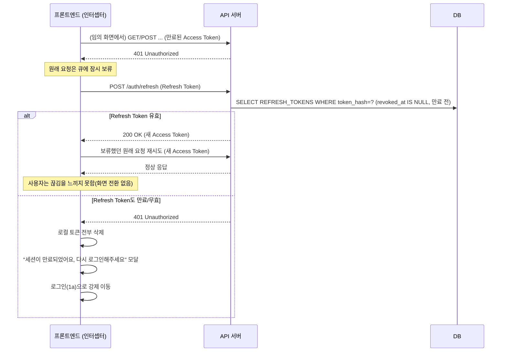

# Clov. 화면 흐름도 — 에러 처리 · 세션 관리

> **기준 문서**: [Clov_API_설계.md](Clov_API_설계.md) · [Clov_DB_설계.md](Clov_DB_설계.md)
> **관련 문서**: [Clov_화면흐름도_프론트엔드.md](Clov_화면흐름도_프론트엔드.md) · [Clov_화면흐름도_백엔드.md](Clov_화면흐름도_백엔드.md)
> **왜 별도 문서인가**: 정상 흐름(화면 A → 액션 → 화면 B)은 프론트/백엔드 문서에 이미 있다. 하지만 실제 개발에서 가장 많이 빠뜨리는 것은 "토큰이 만료되면?", "동시에 두 명이 같은 버튼을 누르면?", "업로드 중간에 저장공간이 찼다면?" 같은 실패 경로다. 이 문서는 정상 흐름 문서 두 개 중 어느 한쪽에만 넣기 애매한, **프론트 반응과 백엔드 에러 코드가 항상 쌍으로 붙어 다니는 내용**만 따로 모았다.

---

## 1. 인증 세션 관리 흐름 (Access Token 만료 · 자동 갱신)

앱 셸(03~08)은 페이지 이동 없이 오래 떠 있는 SPA 화면이라, 세션 중간에 Access Token이 만료되는 상황이 실제로 자주 발생한다. 이걸 화면 흐름에 넣지 않으면 "어느 화면에서든 API가 401을 반환할 수 있다"는 사실이 문서 어디에도 안 남는다.

**설계 규칙**
- 이 인터셉터는 화면별로 따로 구현하지 않고 API 클라이언트 레이어 하나에만 둔다 — 8개 화면군 어디서 401이 나든 동일하게 동작해야, 화면마다 "혹시 여기서도 처리했나?"를 확인하는 부담이 없다.
- 원래 요청이 여러 개 동시에 401을 맞을 수 있으므로(같은 화면에서 여러 API를 병렬 호출 중일 때), refresh 요청은 1회만 보내고 나머지는 그 결과를 기다렸다가 재시도한다(refresh 중복 호출 방지).
- refresh 자체가 실패하면 재시도하지 않고 즉시 로그아웃 처리한다 — 무한 루프 방지.

---

## 2. 에러 코드 ↔ 화면 반응 매핑

[Clov_API_설계.md](Clov_API_설계.md) 3장에 정의된 에러 코드가 실제로 어느 화면에서, 어떤 UI로 사용자에게 보여야 하는지를 표로 고정한다. 이 표가 없으면 같은 에러 코드를 화면마다 다른 방식(어떤 화면은 모달, 어떤 화면은 모달)으로 처리하게 되기 쉽다.

| 에러 코드 | 상태 | 발생 화면(대표) | 프론트 반응 |
|---|---|---|---|
| (전역) 401 Unauthorized | 401 | 모든 화면 | 1장의 refresh 흐름으로 처리. refresh까지 실패해야 로그인으로 이동 |
| `ROOM_MEMBER_NOT_FOUND` | 403 | 나간 방을 북마크/뒤로가기로 재접근 | "더 이상 접근할 수 없는 공간이에요" 안내 모달 → 방 목록(2a)으로 이동 |
| `NOT_WRITER` | 403 | 추억/약속/편지 수정·삭제 | 정상 흐름에서는 작성자 아니면 버튼 자체를 숨기므로 도달하지 않음. 도달 시 "작성자만 할 수 있어요" 모달, 화면은 그대로 유지(방어적 처리) |
| `INVITE_EXPIRED` | 409 | 초대(2d)·방 접속(2e) 코드 입력 | 입력창 아래 인라인 에러 "만료된 코드예요" + 코드 재입력 유도 |
| `INVITE_ALREADY_USED` | 409 | 초대(2d)·방 접속(2e) | 인라인 에러 "이미 사용된 코드예요" |
| `ROOM_FULL` | 409 | 방 접속(2e)·방 목록 코드 입장, 알림 모달 가입 신청 카드(7a) 수락 | 신청 단계: "이 공간은 정원(8명)이 다 찼어요" 안내 모달. 수락 단계: "정원이 다 찼어요" 모달 + 카드는 목록에 유지(신청 자체는 거절되지 않음) |
| `PLAN_HAS_RECORDS` | 409 | 약속 여정 영수증 "삭제"(6a) | 정상 흐름에서는 인증사진이 있는 약속은 삭제 버튼 자체가 "취소"로 대체 표시됨. 도달 시 "이 약속은 기록이 있어 삭제 대신 취소만 가능해요" 모달 |
| `PLAN_NOT_COMPLETED` | 409 | 추억 글쓰기 모달(4d) | 정상 흐름에서는 완료 전 약속엔 "기록하기" 진입점 자체가 없음. 도달 시 모달을 닫고 "아직 완료되지 않은 약속이에요" 모달 |
| `JOIN_REQUEST_ALREADY_PROCESSED` | 409 | 알림 모달 가입 신청 카드(7a) | "이미 처리된 신청이에요 🙌" 모달 + 신청 목록 즉시 새로고침 |
| `JOIN_REQUEST_UNDO_EXPIRED` | 409 | 알림 모달 수락 카드 되돌리기(7b) | 되돌리기 버튼을 즉시 비활성화하고 "되돌릴 수 있는 시간이 지났어요" 모달 |
| `MEMORY_ALREADY_WRITTEN` | 409 | 추억 글쓰기 모달(4d) | "이미 이 약속에 대한 기록이 있어요" 안내 + 기존 글 수정 화면으로 전환 유도(새 글 대신 `PATCH`로 이어가기) |
| `STAGE_LOCKED` | 423 | 인생4컷 프레임 클릭(6c) | 정상 흐름에서는 잠긴 프레임이 클릭 자체가 안 되도록 막혀 있음(🔒 아이콘). 도달 시 "이전 단계를 먼저 완료해주세요" 모달 |
| `STAGE_ALREADY_UPLOADED` | 409 | 인생4컷 프레임 업로드 확인 모달(6c) | 화면명세서에 정의된 "②이미 업로드됐어요" 상태 모달을 그대로 노출 |
| `STORAGE_QUOTA_EXCEEDED` | 507 | 인생4컷 업로드, 추억 사진 첨부 | 화면명세서 "④저장 공간이 부족해요" 모달. 진행 중이던 글쓰기는 서버가 트랜잭션 롤백했으므로 프론트도 임시 저장 상태(초안)를 함께 폐기(3장 참조) |
| `MASCOT_INTERACTION_LIMIT_REACHED` | 429 | 대시보드 마스코트 클릭(3a) | 정상 흐름에서는 3회째 이후 버튼이 비활성 톤으로 바뀌지만, 여러 탭/기기에서 동시에 채운 경우 방어적으로 도달할 수 있음 — "오늘은 여기까지! 내일 또 만나요" 말풍선으로 대체(에러처럼 보이지 않게 캐릭터 톤 유지) |
| `RATE_LIMITED` | 429 | 행운편지 발송, 초대 코드 생성 | "잠시 후 다시 시도해주세요" 모달, 버튼을 수 초간 비활성화(재요청 폭주 방지) |
| (전역) 404 Not Found | 404 | 딥링크·즐겨찾기로 삭제된 리소스 접근 | "삭제되었거나 존재하지 않아요" 안내 후 상위 목록 화면으로 이동 |
| (전역) 500/기타 서버 오류 | 5xx | 모든 화면 | 공통 에러 바운더리: "일시적인 오류가 발생했어요" 모달 + 재시도 버튼. 화면 자체는 무너뜨리지 않음(화이트 스크린 금지) |
| (전역) 네트워크 끊김/타임아웃 | — | 모든 화면 | 상단 오프라인 배너 노출, 재연결 감지 시 현재 화면 데이터 자동 재조회 |

---

## 3. 실패 시 되돌리기(롤백) 정책

서버가 트랜잭션을 롤백해도, 프론트가 낙관적으로 미리 반영해둔 UI 상태를 함께 되돌리지 않으면 "화면엔 저장된 것처럼 보이는데 새로고침하면 사라지는" 유령 상태가 생긴다. 화면별로 무엇을 되돌려야 하는지 정리한다.

| 실패 지점 | 프론트가 미리 반영해둔 것 | 실패 시 되돌리기 |
|---|---|---|
| 추억 글쓰기(4d) 사진 첨부 중 `STORAGE_QUOTA_EXCEEDED` | 사진 미리보기 썸네일, 압축 진행률 | 모달을 닫고 입력 중이던 제목·본문·사진까지 전부 폐기(임시 저장 없음) — 서버가 `MEMORIES` row 자체를 만들지 않았으므로 프론트에만 "쓰다 만" 글이 남지 않게 한다 |
| 인생4컷 업로드(6c) 중 저장공간 부족 | 업로드 진행 스피너, "N/4 업로드 완료" 카운트 | 진행 중이던 프레임만 업로드 전 상태로 되돌림(이미 성공한 이전 프레임은 유지 — `PLAN_STAGE_PHOTOS`는 프레임 단위로 커밋되므로 부분 성공은 그대로 인정) |
| 가입 신청 수락(7a) 중 `JOIN_REQUEST_ALREADY_PROCESSED` | 카드가 "수락 처리 중" 스피너로 즉시 전환된 상태 | 스피너를 원래 카드로 되돌리지 않고, 카드 자체를 목록에서 제거(다른 멤버가 이미 처리했으므로 재조회) |
| 방 프로필 편집(2c) 저장 실패(네트워크 등) | 입력 필드에 반영된 새 이름/소개글 | 입력값은 폼에 유지(사용자가 다시 시도할 수 있도록) — 서버 실패와 사용자 입력 실수를 구분해, 후자만 초기화한다 |

---

## 4. 전역 에러 UI 정책 — 언제 모달/모달/인라인을 쓰는가

에러마다 다른 컴포넌트를 즉흥적으로 고르면 사용자가 "이건 무시해도 되는 건지, 확인해야 하는 건지" 헷갈린다. 기준을 하나로 둔다.

| UI 유형 | 사용 기준 | 예시 |
|---|---|---|
| 모달(자동 소멸) | 사용자의 다음 행동을 막지 않아도 되는 경고·안내 | "이미 처리된 신청이에요", "잠시 후 다시 시도해주세요" |
| 중앙 모달(확인 필요) | 사용자가 다음에 뭘 해야 할지 스스로 판단해야 하는 상황 | "저장 공간이 부족해요", "더 이상 접근할 수 없는 공간이에요" |
| 인라인 에러(필드 하단) | 사용자가 방금 입력한 값 자체가 문제인 경우 | 초대 코드 형식 오류, 로그인 입력 오류(shake) |
| 전역 배너(상단 고정) | 화면 전체에 영향을 주는 상태(개별 액션이 아님) | 네트워크 끊김, 세션 재연결 중 |

이 기준은 [Clov_화면흐름도_프론트엔드.md](Clov_화면흐름도_프론트엔드.md)의 화면별 "프론트 동작" 열에 나온 개별 연출들이 왜 그 형태(모달 vs 모달)를 택했는지의 근거이기도 하다.

---

## 5. 전역 예외 처리 및 데이터 보존 정책 특이사항

> 본 섹션은 개발 중 발생할 수 있는 데이터 정합성과 동시성 문제에 대한 예외 처리 원칙을 정의합니다. (출처: Clov_이벤트_기능_정의서)

1. **낙관적 락(Optimistic Lock):** 방 가입 수락 등 경합 발생 가능한 액션은 데이터베이스 Version을 통한 낙관적 락 처리로 제어하며, 충돌 시 자연스러운 모달 피드백으로 사용자의 혼란을 방지합니다.
2. **증거 불변의 법칙 (Data Immutability):** 한 번 업로드된 인생 4컷(PLAN_STAGE_PHOTOS)은 API 스펙상으로도 `PATCH`/`DELETE`가 불가합니다. 기록이 한 번이라도 누적된 일정(PLAN) 또한 원천적으로 삭제(`DELETE`)할 수 없고 오직 취소(`CANCEL`) 처리만 가능합니다.
3. **SPA 기반 전환:** 대시보드 내부의 탭 간(03~06) 이동은 브라우저 리로드 없이 진행되며, 상태 업데이트 발생 시 즉시 로컬 메모리를 동기화하여 지연감을 없앱니다.
4. **실패 시 롤백 (Fail-safe State Rollback):** API 요청이 실패하면(예: 네트워크 에러, 서버 검증 반려 등) 프론트 UI는 즉각 오류 전 상태로 복원됩니다. 단순 네트워크 오류는 사용자 입력값(초안)을 폼에 유지하여 재시도를 유도하지만, `STORAGE_QUOTA_EXCEEDED` 처럼 DB 저장이 원천 거부된 경우 유령 상태를 방지하기 위해 작성 중이던 내역을 전면 초기화합니다.
5. **다크모드 대응:** 사용자 설정에서 다크모드/테마 변경 시 페이지 리로드 없이 CSS Variable(`--primary-green` 등)을 즉시 교체 적용합니다. 단, 영수증, 편지지와 같은 물리적 종이 질감 객체는 다크모드에서도 라이트 테마 배색을 고정 유지합니다.

